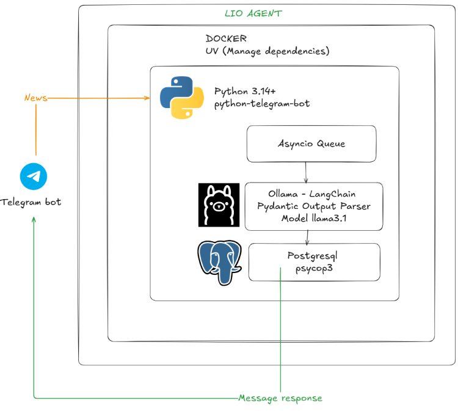

# Lio-Agent: AI-Powered Expense Manager

An asynchronous Telegram bot designed to streamline personal finance tracking. Lio-Agent uses Natural Language Processing (NLP) to transform plain text messages into structured financial data.

## 🚀 Key Features

- **Natural Language Input**: Record expenses by simply chatting (e.g., "Spent 50k on groceries yesterday via Nequi").
- **AI Extraction**: Powered by **Ollama (Llama 3.1)** and **LangChain** for precise data structuring.
- **Async Architecture**: High-performance processing using Python's `asyncio` and `Producer-Consumer` patterns.
- **Smart Resource Management**: Integrated **Semaphore** control to prevent hardware overload during AI inference.
- **SQL Telemetry**: Custom logging cursor for real-time SQL debugging and traceability.

## 🛠 Tech Stack

- **Language**: Python 3.14+
- **Frameworks**: `python-telegram-bot`, `LangChain`
- **AI Inference**: `Ollama`
- **Database**: `PostgreSQL` with `psycopg3` (Connection Pool)
- **Validation**: `Pydantic`
- **Infrastructure**: `Docker` & `Docker Compose`



## 🏗 Architecture Overview

The system operates as a non-blocking pipeline:
1. **Producer**: Telegram bot receives updates and enqueues messages.
2. **Queue**: An asynchronous `asyncio.Queue` acts as a buffer.
3. **Consumers (Workers)**: Multiple background workers pull messages, process them with LLMs via `ainvoke`, and persist data to the DB.

## 🚦 Quick Start

1. **Clone the repo** and set up your `.env` file.
2. **Start Dependencies**: Launch the infrastructure (PostgreSQL and Ollama) in the background:
   ```bash
   docker compose --env-file .env -f docker/docker-compose.dev.yaml up -d postgres ollama ollama-pull-model
   ```
3. **Run Application**: Build and start the bot:
   ```bash
   docker compose --env-file .env -f docker/docker-compose.dev.yaml up --build lio-agent
   ```

## 🧪 Testing

The project includes a comprehensive test suite to ensure reliability and performance.

### Test Types
- **Unit Tests**: Validate individual components (Queue logic, model parsing) in isolation using mocks.
- **Integration (E2E) Tests**: Verify the full message pipeline (Telegram -> Queue -> AI -> DB) using real PostgreSQL and Ollama instances.
- **Stress Tests**: Measure system throughput and stability under high-concurrency message loads.

### Running Tests

#### 1. Unit Tests
To run unit tests in isolation (no external dependencies required):
```bash
uv run pytest tests/unit/
```

#### 2. Integration & E2E Tests
These tests require the infrastructure (DB and AI) to be running.
1. **Start Test Infrastructure**:
   ```bash
   docker compose --env-file tests/.env.test -f docker/docker-compose.test.yaml up -d
   ```
2. **Run Integration Suite**:
   ```bash
   uv run pytest tests/integration/stress_test.py -s
   uv run pytest tests/integration/test_e2e_flow.py -s --log-cli-level=INFO
   ```
*Note: All execution logs are automatically saved to `tests/logs/test_run.log` for detailed inspection.*

### 🚀 E2E Flow Explanation
The End-to-End test simulates a real-world scenario where multiple users send natural language messages to the bot. It validates:
1. **Message Ingestion**: Correct handling of incoming Telegram updates.
2. **AI Processing**: Llama 3.1 correctly identifies amounts, categories, and payment methods.
3. **Data Persistence**: Successful storage in the PostgreSQL database.
4. **Filtering**: Ensuring non-financial messages (e.g., "Hola") are correctly ignored.

You can find a complete execution log example in the root file: `test_example_e2e_flow.log`.

## Author

- **Leidy Acuña** - [GitHub](https://github.com/LeidyAcuna)

## 📄 License

This project is licensed under the MIT License - see the [LICENSE](LICENSE) file for details.
